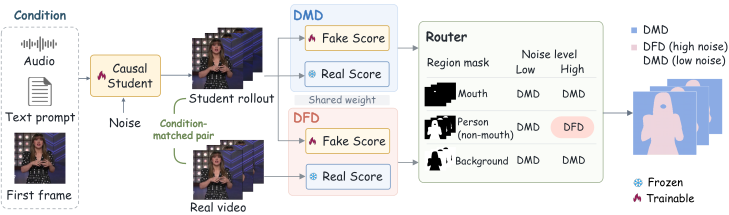

<h2 align="center"><strong>Where and When to Force:<br>Routed Forcing for Streaming Avatars</strong></h2>

<p align="center">
  <a href="https://github.com/Sugewud">Zihan Su</a><sup>1,2*</sup>,
  Siwen Lu<sup>1*</sup>,
  Junhao Zhuang<sup>2†</sup>,
  Zeyue Xue<sup>2</sup>,
  Haoyang Huang<sup>2</sup>,<br>
  Guanghao Li<sup>1</sup>,
  Xiaofeng Tan<sup>3</sup>,
  Chun Yuan<sup>1†</sup>,
  Nan Duan<sup>2</sup>
</p>

<p align="center">
  <sup>1</sup> Tsinghua University &nbsp;
  <sup>2</sup> Joy Future Academy, JD &nbsp;
  <sup>3</sup> Southeast University<br>
  *Equal contribution &nbsp; †Corresponding authors
</p>

<p align="center">
  <a href="https://sugewud.github.io/routed-forcing/"></a> &nbsp;
  <a href="https://arxiv.org/abs/2609.30963"></a>
</p>

## Release

- [09/28] Initial Preview Release 🔥 Coming Soon!

## 🔆 Introduction

We propose **Routed Forcing**, a distillation method for audio-driven streaming avatars that routes supervision by **semantic region** and **noise stage**, improving motion dynamics and diversity while preserving visual quality and lip synchronization.

<br>
<p align="center">
  <a href="assets/method.svg"></a>
</p>
<br>

- **Where to force:** apply Data-Forcing Distillation (DFD) to the non-mouth person region, where motion diversity suffers most from distillation. Retain Distribution Matching Distillation (DMD) for the mouth and background.
- **When to force:** activate DFD only at high noise stages to introduce diverse motion. Use DMD at low noise stages to refine visual details.

The method uses a causal 1.3B student with four sampling steps per block. In the paper's controlled comparison, Routed Forcing improves RAFT-Motion from **5.62 to 7.80 on SpeakerVid** and **3.33 to 4.85 on AVSpeech**, relative to Self Forcing. All four reported diversity metrics improve by approximately **7–25%** across the two datasets. See the [paper](https://arxiv.org/abs/2609.30963) for the full evaluation protocol and results.

## 📖 BibTeX

If you find our work helpful, please consider citing our paper.

```bibtex
@misc{su2026routedforcing,
  title={Where and When to Force: Routed Forcing for Streaming Avatars},
  author={Zihan Su and Siwen Lu and Junhao Zhuang and Zeyue Xue and Haoyang Huang and Guanghao Li and Xiaofeng Tan and Chun Yuan and Nan Duan},
  year={2026},
  eprint={2609.30963},
  archivePrefix={arXiv},
  primaryClass={cs.CV},
  url={https://arxiv.org/abs/2609.30963}
}
```
